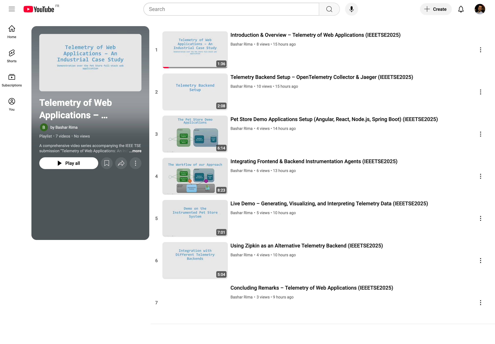

# IEEETSE2025 – Telemetry of Web Applications: An Industrial Case Study
This repository contains the replication package for our paper *Telemetry of Web Applications: An Industrial Case Study* (submitted to IEEE TSE). It includes all data, scripts, and documentation required to reproduce our experiments and validate our findings.

> **Note:** Common instructions and configurations are factored out into this global README. Each replication package (e.g., [Angular/Spring Boot](./replication-angular-spring-boot/README.md), [React/Spring Boot](./replication-react-spring-boot/README.md), [Angular/Node](./replication-angular-node/README.md), [React/Node](./replication-react-node/README.md), [GWT](./replication-gwt/README.md)) has its own README that focuses on package-specific details.

---

## 📂 Table of Contents
1. **Replication Packages:**
   - **[replication-angular-spring-boot](./replication-angular-spring-boot):** Angular frontend and Spring Boot backend.
   - **[replication-react-spring-boot](./replication-react-spring-boot):** React frontend and Spring Boot backend.
   - **[replication-angular-node](./replication-angular-node):** Angular frontend and Node.js backend.
   - **[replication-react-node](./replication-react-node):** React frontend and Node.js backend.
   - **[replication-gwt](./replication-gwt):** GWT frontend application.
2. **Telemetry Instrumentation Agents:**
   - **[Backend Test Automation Agent](./telemetry/instrumentation-backend-test-automation):**
      1. *Agent for backend applications (test automation).*  
      2. Contains prebuilt JARs and source code with its own README.
   - **[Frontend User Experience Agent](./telemetry/instrumentation-frontend-user-experience):**
      1. *Agent for frontend applications (user experience).*  
      2. Contains prebuilt JavaScript bundles and source code with its own README.
3. **Telemetry Backend:**
   - **[Telemetry Backend](./telemetry/telemetry-backend):** Contains the Docker Compose configuration and OpenTelemetry configuration (`otel-config.yaml`) to run the OpenTelemetry Collector and Jaeger.
4. **[Demonstration Videos of our Approach on the Pet Store System](https://www.youtube.com/playlist?list=PLbq4v00GDahK1UTHAm8-P67U9Dd49Xvyd):** A complete guide on using our telemetry approach, from setting up the telemetry backend and the demo Pet Store System, to the integration of instrumentation agents with several observability backends (OpenTelemetry Collector, Jaeger, Zipkin) and real-time trace collection, visualization, and analysis.
[](https://www.youtube.com/playlist?list=PLbq4v00GDahK1UTHAm8-P67U9Dd49Xvyd)


---

## Cloning the Repository
Our repository is composed of multiple submodules that must all be cloned recursively using the following command:

```sh
git clone --recurse-submodules https://github.com/anasshatnawi/IEEETSE2025-Telemetry-of-Web-Applications-An-Industrial-Case-Study
```

## 🛠️ Common Prerequisites
Ensure you have the following installed and accessible on your command line:
- **Java JDK 11+ ☕**
- **Apache Maven 3.x 🛠️**
- **Spring Boot 🚀**
- **Node.js & npm 🟢** 
- **Docker Compose 🐳**

---

## 🚀 Global Replication Steps
### 1. Launch the Telemetry Backend
The telemetry backend is used to collect, store and visualise the collected data. It is located in [telemetry/telemetry-backend](./telemetry/telemetry-backend). It includes:
- An **OpenTelemetry Collector** (listening on ports **4317** for gRPC and **4318** for HTTP) 📡
- A **Jaeger** instance for trace visualization 🔍

**To launch the backend:**

1. Open a terminal and navigate to:
   ```sh
   cd telemetry/telemetry-backend
   ```
2. Launch the services using Docker Compose:
   ```sh
   docker-compose up -d
   ```
3. Verify Jaeger is running at [http://localhost:16686](http://localhost:16686).

---

### 2. Use the Prebuilt Instrumentation Agents
Prebuilt versions of our instrumentation agents are available in the repository. For details, see the [Frontend Agent README](./telemetry/instrumentation-frontend-user-experience/source%20code/agent/README.md) and [Backend Agent README](./telemetry/instrumentation-backend-test-automation/source%20code/agent/README.md).

#### 🌐 Frontend Instrumentation (User Experience)
- **Location:** [telemetry/instrumentation-frontend-user-experience/prebuilt](telemetry/instrumentation-frontend-user-experience/prebuilt)
- **Integration:**

1. Copy the corresponding JavaScript bundle into the right location of the web application, which changes depending on its technology. For example, for Angular frontend applications, the bundle must be placed under `public/assets/telemetry/` folder. For more details on other web technologies, see the replication package-specific READMEs. 
2. Link the bundle to your web application's main HTML file. For example, in your Angular Pet Store frontend application's HTML file:

```html
<body>
   <!-- Existing application content-->
   ... 
   <!-- Link to agent-->
   <script src="assets/telemetry/petstore-frontend-angular-2025-03-24T20-05-46-100Z.js"></script>
</body>
```

#### 🖥️ Backend Instrumentation (Test Automation)
- **Location:** [telemetry/instrumentation-backend-test-automation/prebuilt](telemetry/instrumentation-backend-test-automation/prebuilt)
- **Integration:** Attach the agent to your Java application by adding it as a Java agent (without touching its source code 😄). For example, with the Spring Boot backend application:

  ```bash
  java -javaagent:<path/to/repo>/telemetry/instrumentation-backend-test-automation/prebuilt/instrumentation-backend-test-automation.jar \
     -Dotel.service.name=jpetstore-backend-springboot \
     -Dotel.exporter.otlp.protocol=http/protobuf \
     -Dotel-exporter-otlp-endpoint=http://localhost:4318 \
     -Dotel.metrics.exporter=none \
     -Dotel.instrumentation.common.default-enabled=false \
     -Dotel.instrumentation.endpoints.enabled=true \
     -jar target/PetStore-Monolithique-0.0.1-SNAPSHOT.jar
  ```

Make sure to replace `<path/to/repo>` by your actual local repository's path.

---

### 3. Replication Package–Specific Instructions
Each replication package (e.g., [replication-react-spring-boot](./replication-react-spring-boot/README.md), [replication-angular-node](./replication-angular-node/README.md), [replication-gwt](./replication-gwt/README.md)) includes its own README with detailed instructions for:

- **Application Technologies:** (Angular, React, GWT, etc.)
- **Build & Run Instructions:** for the frontend and backend applications.
- **Screenshots & Trace Query Examples**

Please refer to the README in each replication package directory for further details.

---

## 📬 Contact Information
If you have any questions, feedback, or issues related to the replication package, feel free to reach out to us:

- **Anas Shatnawi**  
  *Senior Research Engineer, Berger-Levrault*  
  📧 [anas.shatnawi@berger-levrault.com](mailto:anas.shatnawi@berger-levrault.com)  
  🔗 [GitHub](https://github.com/anasshatnawi)

- **Bachar Rima**  
  *Research Engineer, Berger-Levrault, PhD Student, University of Montpellier*  
  📧 [bachar.rima@berger-levrault.com](mailto:bachar.rima@berger-levrault.com)  
  🔗 [GitHub](https://github.com/anonbnr)