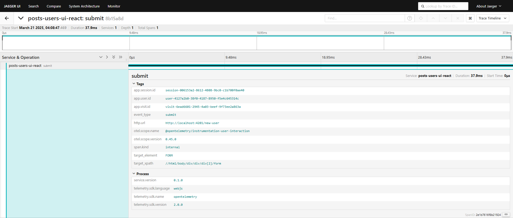

# Replication Package – React Frontend & Node.js Backend  
This folder contains the replication artifacts for the **React/Node.js** configuration used in our study *Telemetry of Web Applications: An Industrial Case Study*. For common instructions (global tools, telemetry backend, instrumentation agent integration, etc.), please refer to the [global README](../README.md) in the repository root.

---

## 📂 Package Contents  
- `posts-users-ui-react/` – React frontend application  
- `posts-users-backend-nodejs/` – Node.js backend application  
- `screenshots/` – Jaeger trace screenshots for the React app  

```plaintext
replication-react-node/
├── posts-users-ui-react/         # React frontend (submodule)
├── posts-users-backend-nodejs/   # Node.js backend (submodule)
└── screenshots/                  # Jaeger trace screenshots
```

---

## 🛠️ Environment Setup
### 🔧 Prerequisites  
Ensure you have the following tools installed (see [global README](../README.md#️-common-tools) for details):
- **Java JDK 11+ ☕**
- **Apache Maven 3.x 🛠️**
- **Node.js & npm 🟢**
- **Docker Compose 🐳**

---

### 🖥️ Node.js Backend
1. Open a terminal and navigate to the backend folder:
   ```sh
   cd replication-react-node/posts-users-backend-nodejs
   ```
2. Install dependencies and run the backend:
   ```sh
   npm install
   npm run dev
   ```
3. The backend service should be running on its configured port (e.g., [http://localhost:5000](http://localhost:5000)).

---

#### 🌐 React Frontend
1. Open another terminal and navigate to the React application folder:
   ```sh
   cd replication-react-node/posts-users-ui-react
   ```
2. Install dependencies and start the application:
   ```sh
   npm install
   npm start
   ```
3. Access the app at: [http://localhost:4201](http://localhost:4201)

---

## 🚀 Replication Steps
### 1. Launch the Telemetry Backend  
Before running the applications, launch the telemetry backend (see [global README](../README.md#-global-replication-steps) for details):
1. Open a terminal and navigate to:
   ```sh
   cd telemetry/telemetry-backend
   ```
2. Launch with Docker Compose:
   ```sh
   docker-compose up -d
   ```
3. Confirm that Jaeger is accessible at [http://localhost:16686](http://localhost:16686).

---

### 2. Instrumentation Integration  
Our prebuilt instrumentation agents are provided in the global repository. For details, see the [global README](../README.md#2-use-the-prebuilt-instrumentation-agents).

#### Frontend Agent 
1. Locate it under `telemetry/instrumentation-frontend-user-experience/prebuilt` in our repository root.
2. Copy it under `public/assets/telemetry/` of the React application.
3. Link it to the application's `index.html` page by adding the following script tag at the end of the page's body.
```html
<body>
   <!-- Existing application content-->
   ... 
   <!-- Link to agent-->
   <script src="assets/telemetry/posts-users-ui-react-2025-03-21T03-03-55-465Z.js"></script>
</body>
```
4. *Note: if the frontend application doesn't use a live reload server to recompile automatically upon change detection, then it must be rebuilt and redeployed again after instrumentation*.

---

### 3. Interact & Verify  
- **User Interactions:** Interact with the React app (e.g., clicks, form submissions) to generate telemetry data.
- **Trace Verification:** Open Jaeger UI ([http://localhost:16686](http://localhost:16686)) to view and analyze the collected frontend traces.

*For submodule-specific configuration details or further instructions, please refer to the individual README files within the corresponding submodules.*

---

## 🔍 Screenshots
### Traces Overview  
This screenshot shows the Jaeger search page (trace timeline and comparator) for the last 100 frontend traces collected in the past hour.  


### Trace Detail  
Since each user interaction produces a single span, this screenshot displays the detailed span view — including all tags (service name, user/session IDs, timestamps) and process metadata.
